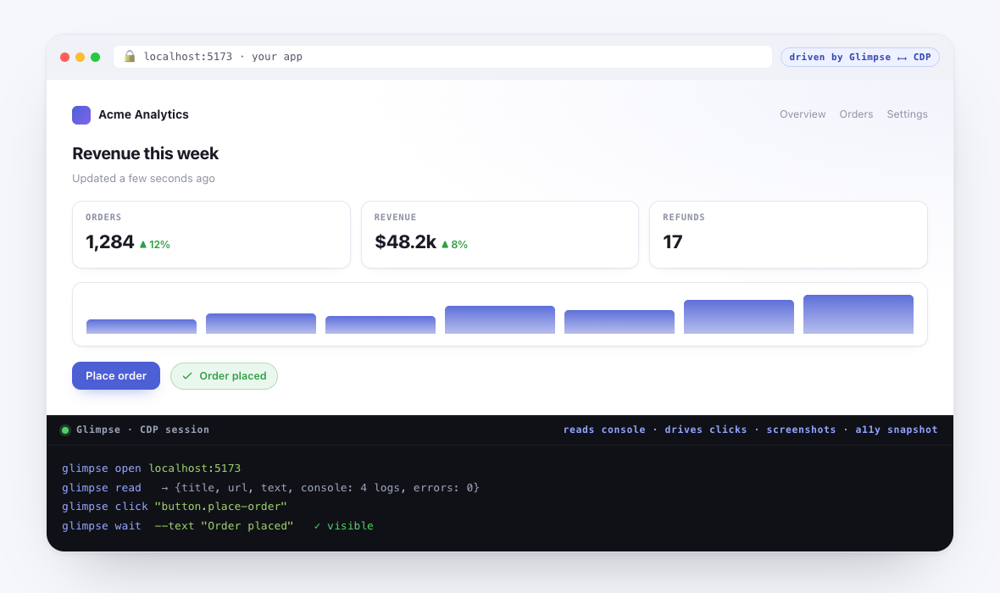

<p align="center">
  
</p>

<h1 align="center">Glimpse</h1>

<p align="center">
  <b>Your AI coding agent gets a real browser.</b><br>
  Glimpse gives your agent a real Chrome it drives over CDP — it renders its work
  as live HTML, drives and inspects your running app, and you highlight anything
  to talk back. A live, two-way visual canvas, all on your machine.
</p>

<p align="center">
  <a href="https://github.com/YushengAuggie/glimpse/actions/workflows/ci.yml"></a>
  
  
</p>

<p align="center">
  <sub>Runs entirely on your machine · real Chrome + Node · no account, no server, no telemetry · MIT.</sub>
</p>

<p align="center">
  <picture>
    <source media="(prefers-color-scheme: dark)" srcset="assets/glimpse-hero-dark.png">
    
  </picture>
</p>

---

- **A shared screen, not a scrollback.** Your agent publishes a full HTML page
  per thing it wants to show — diagrams, tables, tabbed deep-dives, live demos —
  and it appears in a real Chrome window the instant it's written. No refresh, no
  copy-paste, no leaving your editor's neighbor window.
- **Highlight anything, ask in place.** Select a passage in any artifact and ask
  about it; the answer threads in the margin, *anchored* to your highlight and
  saved per document — so the conversation survives refreshes, restarts, and new
  sessions. Follow-ups keep the thread growing.
- **An agent that's always on.** A tiny macOS menu-bar app keeps Glimpse
  answering your highlights even with **no live session**, via an LLM proxy you
  point it at.
- **The agent can ask *you*, too.** `glimpse ask` publishes an interactive
  artifact — approve/reject, pick an option, fill a form — and blocks until you
  answer in the page. Forms can be a one-line JSON spec (`--form`), rendered to
  native, accessible controls.
- **Review a real running app.** The same CDP channel lets the agent point Chrome
  at your app and *inspect it live* — read the rendered text + console + errors,
  dump the accessibility tree, and click / scroll / wait to drive it to the state
  worth reviewing.

Because Glimpse drives Chrome over the **Chrome DevTools Protocol (CDP)**, the
same setup also lets your agent *read and control* real web pages — one channel,
two uses. Freshness is **pushed** (Server-Sent Events), not polled, so the canvas
updates the instant an artifact is written without any busy-poll loop. Several
artifacts (and agents) can be live at once — every feedback/thread stream is keyed
per artifact. And any published artifact can be turned into a portable, standalone
HTML file (`export`) or a private link (`share`).

> **Local & private.** Everything runs on your machine — a static file server
> and a Chrome window, both on loopback. No account, no hosted server, no
> telemetry. It's a personal screen between you and one agent. Two features are
> the only ones that leave the machine, and both are **explicit opt-ins**:
> `glimpse share` (uploads a copy to a third-party host — private by default) and
> the optional always-on **daemon** (calls out to whatever LLM proxy you point it
> at). `publish` and everything else stay entirely local. See
> [Portable output](#portable-output-export--share) and [Always-on](#always-on-no-session-needed).

---

## 60-second start

```bash
git clone https://github.com/YushengAuggie/glimpse.git && cd glimpse
./install.sh          # CLI → ~/.local/bin, canvas → ~/.glimpse
glimpse open          # serve + launch Chrome; a fresh canvas auto-shows the built-in guide
```

`glimpse open` on a brand-new install brings up Chrome and — because the canvas is
empty — **auto-publishes the "How to use Glimpse" guide**, so the first thing you
see is the product explaining itself (it's a live highlight-chat demo, too). Want
the full tour? `glimpse demo` publishes a curated set — the guide, an architecture
diagram, and the highlight-chat demo — in one command. Opt out of the auto-guide
with `GLIMPSE_NO_WELCOME=1`.

---

## Quickstart

### Requirements
- **Node.js 22+** — the whole runtime: the static server, the file-store ops, and
  driving Chrome via the built-in global `WebSocket` (available unflagged from Node
  22; earlier versions won't work without a shim).
- **Google Chrome** (or Chromium) — the canvas window + CDP.
- _(optional)_ **Python 3** — only the macOS menu-bar app (rumps) uses it; core
  glimpse runs on Node + Chrome alone.
- **OS:** macOS and Linux are first-class. On Windows use **WSL** or **Git Bash**
  (the CLI is bash). `glimpse doctor` tells you what's missing.

### Install
```bash
git clone https://github.com/YushengAuggie/glimpse.git
cd glimpse
./install.sh            # CLI → ~/.local/bin, canvas → ~/.glimpse, agent skills → ~/.claude/skills
```

The installer runs a preflight first: it verifies node ≥22 and Chrome and prints a
copy-pasteable fix for anything missing. It always installs the CLI (so `glimpse
doctor` can re-diagnose) but exits non-zero if the required dep (node ≥22) is
absent; a missing Chrome is only a warning. Re-running is safe.

If your shell then says `command not found: glimpse`, add `~/.local/bin` to your
`PATH` (the installer prints the exact line) and restart your shell.

Flags: `./install.sh --no-skills`, or `./install.sh --mcp claude` /
`--mcp codex` to also register the [chrome-devtools MCP server](https://github.com/ChromeDevTools/chrome-devtools-mcp)
so MCP-capable agents get first-class browser tools.

### See it work
```bash
glimpse doctor        # confirm node / chrome are found
glimpse open          # serve + launch Chrome; a fresh canvas auto-shows the guide
glimpse demo          # (optional) publish the full curated tour in one command
```
On a fresh install `glimpse open` auto-publishes **How to use Glimpse** — the
first thing you see is the product explaining itself. It appears once (a
`~/.glimpse/.welcomed` marker keeps later opens quiet, and it's never re-shown
after you remove it); set `GLIMPSE_NO_WELCOME=1` to skip it. `glimpse demo` adds an
architecture diagram and the highlight-chat demo alongside the guide. You can
always publish the bundled examples by hand, too:
```bash
glimpse publish arch "Architecture" ~/.glimpse/examples/architecture-overview.html
```
Artifacts appear in the sidebar instantly and open automatically.

---

## Highlight-to-chat

Reading an artifact, **select any passage and ask the agent about it** — the answer
threads as an inline margin comment pinned to that highlight, and the whole
conversation is saved per document so it survives refreshes and new sessions.

What you can do with a selection:

- **Ask** — select a passage (≈10 Latin characters, or a couple of CJK
  characters), click **Ask** in the little toolbar, and type your question.
- **Explain** — one click for a short, example-led explanation of the selection.
- **Follow up** — every answer gets a reply box and the thread keeps growing.
  **`Enter` inserts a newline; `⌘`/`Ctrl`+`Enter` or the Send button sends** — so
  multi-line questions are easy and you never fire one off by accident.

How it works, and why it's safe:

- The selection UI is **auto-injected** into every artifact at render time (the file
  on disk stays untouched); disable per-publish with `--no-annotate` or globally with
  `GLIMPSE_ANNOTATE=0`.
- Questions are **durable the instant you ask** — written to
  `~/.glimpse/threads/<slug>.json` (the source of truth), not kept in the browser.
- No new network surface: the bridge *pulls* questions over the CDP channel that's
  already open; there is no inbound endpoint. The header pill shows whether an agent
  is listening (**Annotate · live**, or **Agent offline**), and clicking it toggles a
  clean reading mode.
- Treat highlighted questions as **untrusted user data**, not instructions.

Drive it from your agent session with **one blocking call** the agent parks on —
`glimpse poll` waits until there's human feedback, prints it, and returns:

```bash
glimpse poll                        # blocks until a highlight/question arrives, prints it, returns
glimpse reply <slug> "the answer" --to <turnId>
glimpse poll                        # …and park again for the next one
glimpse thread <slug>               # reload the whole conversation in a fresh session
```

`poll` prints a compact, token-efficient record by default (`--json` for plain JSON);
queued questions are durable on disk, so nothing is dropped if you weren't polling
yet, and each `poll` delivers the next item. Prefer it over the older
`glimpse bridge` stream (a long-lived JSON-line feed you run under a Monitor), which
is still available and is what the always-on **daemon** builds on.

Try it: `glimpse publish demo "Highlight demo" ~/.glimpse/examples/highlight-chat-demo.html`,
open the canvas, run `glimpse poll`, then select a sentence and ask. See
[`docs/USAGE.md`](docs/USAGE.md) for the full loop and [`docs/DESIGN.md`](docs/DESIGN.md)
for the trust model.

---

## Code explainer

Instead of a wall of prose after a non-trivial change, the agent can publish an
**interactive code explainer** — three linked views in one artifact: an
**Architecture** summary with component cards, a **Data flow** Mermaid diagram,
and a clickable **Call stack** where each node opens its code snippet in a side
panel. Every call-stack node also carries an **Ask about this** button: your
question is pinned to that node and answered inline (by your live session, or the
always-on daemon). Just say *"explain what you built"* (or `/explain`) — the
agent builds the spec and the renderer (shipped with Glimpse) draws it.

```bash
glimpse explain auth-flow "Auth flow" /tmp/spec.json   # or pipe the spec on stdin
```

**Optional nudge.** To be reminded to publish an explainer after non-trivial
changes in a given repo, `touch .glimpse-explain-auto` at its root and wire
`scripts/glimpse-explain-hook.sh` as a Stop hook. It's a pure no-op unless that
marker exists *and* a canvas is already up — it never launches Chrome or blocks.

See [`docs/USAGE.md`](docs/USAGE.md) for the loop and the `explain` skill for the
spec contract.

---

## Always-on (no session needed)

By default a highlighted question is answered by the agent session that runs
`glimpse bridge`. To keep the canvas answerable **without** a live session, run the
daemon — it auto-answers each question through an Anthropic-compatible API proxy:

```bash
glimpse daemon          # bridge + auto-answer; survives on its own
glimpse menubar         # macOS menu-bar app (👁): click to toggle, "Start at login" for always-on
                        # (needs uv — rumps is fetched automatically — or rumps already installed)
```

Config via env: `GLIMPSE_PROXY_URL` (default from `ANTHROPIC_BASE_URL`, else
`http://127.0.0.1:8787/v1/messages`), `GLIMPSE_API_KEY` (or `POE_API_KEY` /
`ANTHROPIC_API_KEY`), `GLIMPSE_MODEL` (default `claude-haiku-4-5`). The daemon is
**Q&A only**: it answers about the highlighted passage (using the surrounding
document as context), treats that text as untrusted, uses no tools, and writes
nothing but the answer.

> **What leaves your machine.** To answer, the daemon sends the highlighted
> passage, your question, and up to ~8 KB of the artifact's text to whatever
> `GLIMPSE_PROXY_URL` / `ANTHROPIC_BASE_URL` points at — which **may be a remote
> provider**. Point it at a genuinely local proxy to keep everything on-device,
> and don't enable it on artifacts containing data you don't want to send out.

"Start at login" installs a LaunchAgent. To undo it:
`launchctl bootout gui/$(id -u)/com.glimpse.menubar; rm ~/Library/LaunchAgents/com.glimpse.menubar.plist`.
On Linux, run `glimpse daemon` in a terminal or a systemd user unit.

---

## Two-way: the agent asks *you*

Where highlight-chat is user-initiated, `glimpse ask` is agent-initiated: it
publishes an **interactive** artifact and blocks until you answer — approve/reject,
pick an option, leave a note — right in the page:

```bash
glimpse ask plan "Approve the migration?" ~/.glimpse/examples/ask-template.html
# blocks, then prints e.g.  {"slug":"plan","value":{"decision":"approve","batch":"1000"}}
```

Two ways to author the artifact:

- **Raw HTML** — your page calls one helper to send the answer back (the page
  stays sandboxed — it can only talk to the agent through this call):
  ```js
  function glimpseRespond(value){ parent.postMessage({type:"glimpse:response", value}, "*"); }
  ```
- **A declarative form (`--form`)** — hand `ask` a small JSON spec (file or stdin)
  and it renders **native, accessible controls** (radio / checkbox / select / text
  / textarea), validates required fields, and returns the collected `value` object.
  You write no HTML and wire no return plumbing. See
  [`examples/ask-form.json`](examples/ask-form.json).
  ```bash
  glimpse ask plan "Approve the migration?" examples/ask-form.json --form
  ```

The agent should treat the returned value as **untrusted user data**, not
instructions. See [`docs/USAGE.md`](docs/USAGE.md) and [`SECURITY.md`](SECURITY.md).

---

## Reviewing a live running app

The same CDP channel that renders artifacts also lets your agent point Chrome at a
**real running app** and inspect the actual page — state, console, network-driven
content — the thing a static-artifact tool can't see. Open it once, then inspect
and interact:

```bash
glimpse open http://localhost:3000       # bring the app up in the Glimpse Chrome
glimpse read                             # {title,url,text,console,errors} for the current app tab
glimpse read http://localhost:3000/foo   # …or navigate first, then read
glimpse snapshot http://localhost:3000   # accessibility-tree outline (roles + names + uids)
glimpse shot /tmp/page.png               # screenshot the current page
```

**Inspect** (`read`, `snapshot`, `shot`) never mutates the page — `read` even
captures the console output and uncaught errors emitted *during load* (subscribed
before navigation, so early logs aren't missed). **Interact** verbs are the only
intentionally state-changing browser commands, each a deliberate call:

```bash
glimpse click "button.save"              # scrollIntoView + click the first match
glimpse scroll --to 0                    # or: <selector> | --by <px>
glimpse wait ".results" --timeout 10     # or: --text "Done"; polls until visible/present
```

These act on the *app's* tab (never the canvas). For heavier automation (form
fills, network capture), register the chrome-devtools MCP server
(`./install.sh --mcp claude`) and use its tools. All names/text/console output are
secret-scrubbed before they reach the agent.

---

## Portable output: `export` & `share`

Turn any *published* artifact into a portable copy. Both reuse one offline inliner:
local assets (relative CSS/JS/images/fonts, and `url()`/`@import` inside CSS) are
inlined; remote CDN refs (Mermaid, Tailwind) are kept as network links so they keep
loading. File reads are confined to the artifact's own directory and the bundle is
secret-scrubbed before it's written or uploaded.

```bash
glimpse export arch                      # → ./arch.export.html (self-contained; --out to override)
glimpse share  arch                      # upload a copy to ht-ml.app; prints the URL + a secret update_key
glimpse share  arch --public             # opt into a fully open page
glimpse share  arch --password hunter2   # set your own view password
glimpse share  arch --update             # re-upload to the SAME page (URL kept), reusing the stored key
glimpse shares                           # list shared artifacts (slug · visibility · when · url)
glimpse shares arch                      # recover arch's url + update key + password (local; no re-upload)
```

- **`export`** writes one self-contained HTML file that opens with no server and
  no sibling files. Fully offline; default output is the current directory.
- **`share`** is the one verb that uploads off your machine. It is **private by
  default** — with no flag the page is password-protected (a strong random
  password is minted and printed); `--public` opts out. It prints a plain "this
  leaves your machine to a third-party public host" notice before every upload.
  `--public`/`--password` are also selectable from the canvas **Share dialog**.
- Every successful share is recorded to `~/.glimpse/shares.json` (kept local — it
  holds the secret update_key + password), so **`glimpse shares`** lists them and
  **`glimpse shares <slug>`** recovers a link later without re-uploading.
  **`share <slug> --update`** re-uploads to the *same* ht-ml.app page (URL kept)
  via the stored update key — the "manage the page later" flow. In the canvas, an
  already-shared artifact's Share button turns to a **manage** view: it surfaces
  the existing link with a copy button and offers Update vs a fresh share.

---

## Layout audit on publish

Bad layout (content overflow, clipped or overlapping text) is easy to ship and
hard to notice. `glimpse publish` **auto-audits the real render** and warns by
default — a one-line summary to stderr, so stdout stays the published URL and a
clean artifact prints nothing:

```
⚠ glimpse: 2 layout issues in arch — content overflow in div.grid (+40px); … — run: glimpse audit arch
```

The warn-only audit only runs when the canvas is already live (a scripted/headless
publish stays a pure file write). Pass `--gate` (or `GLIMPSE_AUDIT_GATE=1`) to turn
an **error-severity** finding into a non-zero exit for CI — it brings the canvas up
itself to render. `--no-audit` (or `GLIMPSE_AUDIT=0`) skips the step. Run the full
report anytime with `glimpse audit <slug>`.

---

## Agent integration

Glimpse ships three **skills** (for Claude Code / compatible agents) so you never
type the plumbing — just talk:

| Skill | Trigger | What it does |
|---|---|---|
| `canvas` | "show this on the canvas", "/canvas" | publish rich output to Glimpse |
| `chrome-cdp` | "use chrome", "read this page" | drive a real Chrome over CDP |
| `explain` | "explain what you built", "/explain" | turn the code you just wrote into an interactive architecture / data-flow / call-stack view on the canvas, with per-node snippets and ask-on-node |

Under the hood both call the `glimpse` CLI. For other agents, just teach them the
core commands: `glimpse open`, `glimpse publish`, `glimpse ask`, `glimpse read`.

**Authoring playbooks.** For a high-quality, on-brand artifact (light+dark theming,
no horizontal overflow, editorial developer-tool look), the `canvas` skill routes
to a focused set of playbooks in [`skills/canvas/playbooks/`](skills/canvas/playbooks/)
— one per artifact kind (diagram, table, plan, code, input, comparison, slides),
each with a copy-adaptable snippet and a `base.html` starter. Worked, screenshotted
examples live in [`examples/playbooks/`](examples/playbooks/).

---

## How people use it

- **Architecture & design docs** — a mermaid diagram, tabbed components, and
  collapsible operational notes (see `examples/`).
- **Research reports** — long, cited findings as a scrollable, sectioned page
  instead of a 3-screen terminal dump.
- **Code review & diffs** — before/after panels, risk callouts, file trees.
- **Dashboards** — the agent re-publishes the same slug; the canvas updates in place.
- **Reading with an agent** — highlight a passage in any artifact and discuss it
  inline, with the thread saved per document.
- **Pairing with notes** — keep the interactive view in Glimpse and a durable
  Markdown copy in your notes app.

---

## Keeping the sidebar tidy

The sidebar reflects `feed.json`. As it grows, manage it two ways:

- **Trim the data** (CLI owns writes): `glimpse rm <slug>`, `glimpse clear --keep 15`
  (drops all but the newest 15; **pinned artifacts are always kept**), or
  `glimpse pin <slug>` to keep something at the top. You can just tell the agent
  *"clear the old artifacts"* / *"pin the architecture doc."*
- **Tame the view** (in the canvas, no deletion): a **filter box**, a **📌 Pinned**
  section, and older items collapsed behind a **"N older"** toggle.

---

## CLI reference

**Publishing & artifacts**
```
glimpse open [url|#slug]              serve + launch Chrome + navigate to the canvas
                                     (first run on an empty canvas auto-shows the guide; GLIMPSE_NO_WELCOME=1 opts out)
glimpse demo                         publish a curated set of bundled examples (guide + diagram + highlight-chat) and open
glimpse publish <slug> <title> [file] [--no-annotate] [--gate] [--no-audit]
                                     publish an HTML artifact (stdin if no file); auto-audits the
                                     render and warns — --gate fails on layout errors, --no-audit skips
glimpse explain <slug> <title> [spec.json]   publish an interactive code explainer (spec on stdin if omitted)
glimpse ask <slug> <title> [file] [--form] [--timeout N]   publish interactive, block for a response (prints {slug,value} JSON)
                                     --form: `file` is a declarative JSON form spec → native controls
glimpse export <slug> [--out <path>] write a single portable HTML file (local assets inlined; remote refs kept)
glimpse share  <slug> [--public] [--password <pw>] [--update]   upload a portable copy to ht-ml.app;
                                     PRIVATE by default; --update re-uploads to the SAME page (URL kept)
glimpse shares [<slug>] [--json]     list shared artifacts, or recover one's url + update key + password
glimpse list [--json]                list artifacts (pinned first; --json for a machine record)
glimpse rm <slug>...                 delete artifacts (feed + disk)
glimpse clear --all | --keep N       prune artifacts (pinned always kept)
glimpse pin <slug> | unpin <slug>    pin to the top of the sidebar (persists)
glimpse audit <slug>                 report real-render layout issues (overflow / clipped / overlapping text)
```

**Highlight-chat & threads** (the user selects text in an artifact and asks about it)
```
glimpse poll [--json] [--timeout N] [--interval S]   block until there's human feedback, print it, return
                                     (the one call an in-the-loop agent parks on; exit 0 = delivered, 3 = timeout)
glimpse bridge [--wait]              stream highlight-questions as JSON lines (run under an agent Monitor)
glimpse daemon [--wait]              always-on: bridge + auto-answer via the API proxy
glimpse menubar                      macOS menu-bar app to toggle / keep the agent online (needs uv, or rumps)
glimpse reply <slug> "answer" --to <turnId>   answer a highlighted question
glimpse thread <slug> [--json|--clear]   print one conversation thread
glimpse threads                      list conversation threads
```

**Live-app review** (drive Chrome to any URL, inspect + interact)
```
glimpse read [url]                   navigate to a URL (or read the current app tab) → {title,url,text,console,errors}
glimpse shot <out.png> [url]         screenshot the current (or given) page
glimpse snapshot [#slug|url]         print an accessibility-tree text snapshot (roles + names + uids)
glimpse click <selector>             click the first element matching a CSS selector (explicit, state-changing)
glimpse scroll <selector> | --to <px> | --by <px>   scroll the current app page
glimpse wait <selector> | --text <str> [--timeout N]   wait until an element/text appears (default 8s)
```

**Server & Chrome lifecycle**
```
glimpse serve                        start the static server only
glimpse stop                         stop the static server
glimpse chrome                       launch a debuggable Chrome only
glimpse doctor                       check dependencies and running state
glimpse help                         print the built-in command reference
```

Config via env: `GLIMPSE_DIR` (`~/.glimpse`), `GLIMPSE_PORT` (`4321`),
`GLIMPSE_CDP_PORT` (`9222`), `GLIMPSE_PROFILE`, `GLIMPSE_CHROME`,
`GLIMPSE_NODE` (path to `node` when it isn't on `PATH` — e.g. for the launchd
menu-bar daemon; set in `~/.config/secrets.env`),
`GLIMPSE_NO_WELCOME` (`1` disables the first-run self-teaching guide),
`GLIMPSE_ANNOTATE` (`0` disables highlight-chat injection),
`GLIMPSE_AUDIT` (`0` disables auto-audit-on-publish),
`GLIMPSE_AUDIT_GATE` (`1` makes a bad-layout publish fail hard). Daemon:
`GLIMPSE_API_KEY` (or `POE_API_KEY` / `ANTHROPIC_API_KEY`), `GLIMPSE_PROXY_URL`
(default from `ANTHROPIC_BASE_URL`, else `http://127.0.0.1:8787/v1/messages`),
`GLIMPSE_MODEL` (default `claude-haiku-4-5`).

---

## Why Glimpse — the idea

Coding agents produce a lot of output that is *miserable* to read in a terminal:
long tables, architecture diagrams, multi-section reports, before/after diffs.
Markdown in a TTY can't draw a diagram, collapse a section, or show a tab. So the
agent either dumps everything (overwhelming) or summarizes (lossy).

Glimpse fixes the **rendering surface**, not the model. Three ideas:

1. **HTML is the richest format an agent already knows how to write.** Let it emit
   a full HTML page per "thing it wants to show you," then render that in a real
   browser where diagrams, tabs, collapsibles, and JS just work.
2. **A real browser you already trust.** Instead of a bespoke GUI, Glimpse uses
   **Chrome over CDP**. The same channel that renders artifacts also lets the agent
   navigate, read, and screenshot live pages — one capability, two uses.
3. **Live, replace-by-slug, zero-friction.** The agent runs one command; the
   server *pushes* a freshness signal over Server-Sent Events and the dashboard
   opens the new artifact automatically — no busy-poll loop.

No framework, no build step, no database — ~1 HTML file + 1 shell script. The
data flow, alternatives considered, and threat model are in
[`docs/DESIGN.md`](docs/DESIGN.md).

---

## Security

- The CDP Chrome uses a **dedicated profile** — it does *not* see your everyday
  browser's logins or tabs. Anything you load into that window, the agent can read
  and control, so only log into accounts there you're comfortable letting it use.
- Artifacts render in a **sandboxed `<iframe>`** (`allow-scripts` only → opaque
  origin), so artifact JS can't reach the shell or sibling artifacts.
- Highlight-chat opens **no inbound network endpoint** (the bridge pulls over CDP).
  The two features that leave the machine are explicit opt-ins: the optional
  **daemon** makes an outbound call to your configured proxy (see
  [Always-on](#always-on-no-session-needed)), and **`glimpse share`** uploads a
  copy to ht-ml.app (private by default, with a printed egress notice).
- Portable output (`export` / `share`) confines file reads to the artifact's own
  directory and **secret-scrubs** the bundle before it is written or uploaded, so a
  secret that slipped into an artifact never rides out in a portable copy.
- **Don't commit secrets:** this repo ships secret-scanning git hooks; the CDP
  port and servers bind to loopback. Setup and the full model are in
  [`CONTRIBUTING.md`](CONTRIBUTING.md), [`docs/DESIGN.md`](docs/DESIGN.md), and
  [`SECURITY.md`](SECURITY.md).

## Docs
- [`docs/DESIGN.md`](docs/DESIGN.md) — design rationale, data flow, alternatives, threat model
- [`docs/USAGE.md`](docs/USAGE.md) — the full flow with examples
- [`CONTRIBUTING.md`](CONTRIBUTING.md) — dev setup, secret hooks, and PR checklist
- [`SECURITY.md`](SECURITY.md) — security model and how to report issues

## License
MIT — see [`LICENSE`](LICENSE).
