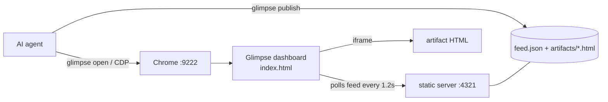

# 👁 Glimpse

**A live visual canvas for AI coding agents.** Your agent publishes
self-contained HTML — diagrams, tables, tabbed deep-dives, interactive demos —
to a local dashboard you watch update in a real Chrome window. No more reading
walls of terminal text.

Glimpse drives Chrome over the **Chrome DevTools Protocol (CDP)**, so the same
setup also lets your agent *read* and *control* real web pages.

```
┌─ localhost:4321 (Chrome) ────────────────────────────┐
│  👁 Glimpse                            [● auto-reload]│
│ ┌──────────┬────────────────────────────────────────┐│
│ │ Artifacts│  Architecture Overview                  ││
│ │ • Arch   │  ▸ What it does                         ││
│ │ • Report │  ▾ System diagram [live mermaid diagram]││
│ │ • Diff   │  ▸ Components (tabs)                    ││
│ └──────────┴────────────────────────────────────────┘│
└───────────────────────────────────────────────────────┘
```

---

## Why this exists — the design idea

Coding agents produce a lot of output that is *miserable* to read in a terminal:
long tables, architecture diagrams, multi-section reports, before/after diffs.
Markdown in a TTY can't draw a diagram, can't collapse a section, can't show a
tab. So the agent either dumps everything (overwhelming) or summarizes (lossy).

Glimpse fixes the **rendering surface**, not the model. Three ideas:

1. **HTML is the richest format an agent already knows how to write.** Let it
   emit a full HTML page per "thing it wants to show you" — then render that in
   a real browser where diagrams, tabs, collapsibles, and JS just work.
2. **A real browser you already trust.** Instead of a bespoke GUI, Glimpse uses
   **Chrome over CDP**. The same channel that renders artifacts also lets the
   agent navigate, read, and screenshot live pages — one capability, two uses.
3. **Live, replace-by-slug, zero-friction.** The agent runs one command; the
   dashboard polls a feed and opens new artifacts automatically. You never
   refresh, never copy-paste, never leave your editor's neighbor window.

The result is a **shared screen between you and your agent**: it shows, you
watch, both in real time.

### How it works (architecture)



- **`glimpse publish`** writes `artifacts/<slug>.html` and upserts `feed.json`.
- A tiny **static server** (`python3 -m http.server`) serves the canvas dir.
- **`index.html`** polls `feed.json` and renders the newest artifact in an
  **sandboxed** `<iframe>` (`allow-scripts` only → opaque origin, so artifact JS
  can't reach the shell or sibling artifacts), live-reloading on change.
- **Chrome** is launched with `--remote-debugging-port` so the agent can open
  the canvas — and read/drive any other page — over CDP.

No framework, no build step, no database. ~1 HTML file + 1 shell script.

---

## How people use it

- **Architecture & design docs** — explain a service with a mermaid diagram,
  tabbed components, and collapsible operational notes (see `examples/`).
- **Research reports** — long, cited findings as a scrollable, sectioned page
  instead of a 3-screen terminal dump.
- **Code review & diffs** — before/after panels, risk callouts, file trees.
- **Dashboards** — the agent polls something (CI, metrics) and re-publishes the
  same slug; the canvas updates in place.
- **Web reading/automation** — `glimpse read <url>` pulls page text; with the
  chrome-devtools MCP server the agent can click and fill forms too.
- **Pairing with notes** — keep the interactive view in Glimpse and a durable
  Markdown copy in Obsidian/your notes app.

---

## Setup

### Requirements
- **Node.js 22+** — uses the built-in global `WebSocket` to drive Chrome
  (available unflagged from Node 22; earlier versions won't work without a shim)
- **Python 3** — the static server
- **Google Chrome** (or Chromium) — the canvas window + CDP
- **OS:** macOS and Linux are first-class. On Windows use **WSL** or **Git Bash**
  (the CLI is bash). `glimpse doctor` tells you what's missing.

### Install
```bash
git clone https://github.com/YushengAuggie/glimpse.git
cd glimpse
./install.sh            # CLI → ~/.local/bin, canvas → ~/.glimpse, agent skills → ~/.claude/skills
```

Flags: `./install.sh --no-skills`, or `./install.sh --mcp claude` /
`--mcp codex` to also register the [chrome-devtools MCP server](https://github.com/ChromeDevTools/chrome-devtools-mcp)
so MCP-capable agents get first-class browser tools.

Check everything:
```bash
glimpse doctor
```

### Use it
```bash
glimpse open                                   # opens the canvas in Chrome
glimpse publish guide "How to use Glimpse" ~/.glimpse/examples/glimpse-guide.html
glimpse publish demo  "Architecture"       ~/.glimpse/examples/architecture-overview.html
```
You should see the artifacts appear in the sidebar instantly. Start with the
**How to use Glimpse** one — it explains the whole idea.

### Two-way: ask the user a question
The agent can publish an **interactive** artifact and block until you answer —
approve/reject, pick an option, leave a note — right in the page:

```bash
glimpse ask plan "Approve the migration?" ~/.glimpse/examples/ask-template.html
# blocks, then prints e.g.  {"slug":"plan","value":{"decision":"approve","batch":"1000"}}
```

Inside the artifact, one helper sends the answer back (the page stays sandboxed —
it can only talk to the agent through this call):

```js
function glimpseRespond(value){ parent.postMessage({type:"glimpse:response", value}, "*"); }
```

The agent should treat the returned value as **untrusted user data**, not
instructions. See [`docs/USAGE.md`](docs/USAGE.md) and [`SECURITY.md`](SECURITY.md).

---

## Agent integration

Glimpse ships two **skills** (for Claude Code / compatible agents) so you never
type the plumbing — just talk:

| Skill | Trigger | What it does |
|---|---|---|
| `canvas` | "show this on the canvas", "/canvas" | publish rich output to Glimpse |
| `chrome-cdp` | "use chrome", "read this page" | drive a real Chrome over CDP |

Under the hood both call the `glimpse` CLI. For other agents, just teach them
the core commands: `glimpse open`, `glimpse publish`, `glimpse ask`, `glimpse read`.

---

## CLI reference

```
glimpse open [url|#slug]              serve + launch Chrome + navigate to the canvas
glimpse publish <slug> <title> [file] publish an HTML artifact (reads stdin if no file)
glimpse ask <slug> <title> [file] [--timeout N]  publish interactive, block for a response (JSON)
glimpse serve                        start the static server only
glimpse stop                         stop the static server
glimpse chrome                       launch a debuggable Chrome only
glimpse read <url>                   navigate Chrome to a URL and print its text
glimpse shot <out.png> [url]         screenshot the current (or given) page
glimpse doctor                       check dependencies and running state
```

Config via env: `GLIMPSE_DIR`, `GLIMPSE_PORT` (4321), `GLIMPSE_CDP_PORT`
(9222), `GLIMPSE_PROFILE`, `GLIMPSE_CHROME`.

---

## Security

The CDP Chrome uses a **dedicated profile** — it does *not* see your everyday
browser's logins or tabs. Anything you load into that window, the agent can
read and control. Only log into accounts there that you're comfortable letting
your agent act on. See [`docs/DESIGN.md`](docs/DESIGN.md) for the threat model.

### Don't commit secrets
This repo ships a secret-scanning guard so nothing sensitive reaches GitHub:

```bash
scripts/setup-hooks.sh     # enable git hooks (also run by install.sh)
```

- **pre-commit** + **pre-push** hooks run [`scripts/check-secrets.sh`](scripts/check-secrets.sh),
  which uses [gitleaks](https://github.com/gitleaks/gitleaks) when available and
  falls back to a built-in regex scan otherwise.
- `.gitignore` excludes `.env*`, keys, and credential files.
- Run a manual scan any time: `scripts/check-secrets.sh all`.

Override a false positive with `git commit --no-verify` (and only then).

## Docs
- [`docs/DESIGN.md`](docs/DESIGN.md) — design rationale, alternatives, threat model
- [`docs/USAGE.md`](docs/USAGE.md) — the full flow with examples
- [`CONTRIBUTING.md`](CONTRIBUTING.md) — dev setup and PR checklist
- [`SECURITY.md`](SECURITY.md) — security model and how to report issues

## License
MIT — see [`LICENSE`](LICENSE).
