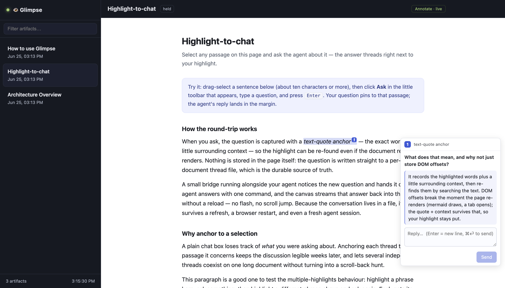

<p align="center">
  
</p>

<h1 align="center">Glimpse</h1>

<p align="center">
  <b>A live, two-way visual canvas for AI coding agents.</b><br>
  Your agent shows its work as rendered HTML in a real browser — and you can
  highlight any passage and talk back. No walls of terminal text.
</p>

<p align="center">
  
</p>

---

- **A shared screen, not a scrollback.** Your agent publishes a full HTML page
  per thing it wants to show — diagrams, tables, tabbed deep-dives, live demos —
  and it appears in a real Chrome window the instant it's written. No refresh, no
  copy-paste, no leaving your editor's neighbor window.
- **Highlight anything, ask in place.** Select a passage in any artifact and ask
  about it; the answer threads in the margin, *anchored* to your highlight and
  saved per document — so the conversation survives refreshes, restarts, and new
  sessions. Follow-ups keep the thread growing.
- **An agent that's always on.** A tiny macOS menu-bar app keeps Glimpse
  answering your highlights even with **no live session**, via an LLM proxy you
  point it at.

Because Glimpse drives Chrome over the **Chrome DevTools Protocol (CDP)**, the
same setup also lets your agent *read and control* real web pages.

> **Local & private.** Everything runs on your machine — a static file server
> and a Chrome window, both on loopback. No account, no hosted server, no
> telemetry. It's a personal screen between you and one agent. (The optional
> always-on daemon is the one part that can call out — see [Always-on](#always-on-no-session-needed).)

---

## Quickstart

### Requirements
- **Node.js 22+** — uses the built-in global `WebSocket` to drive Chrome
  (available unflagged from Node 22; earlier versions won't work without a shim).
- **Python 3** — the static server.
- **Google Chrome** (or Chromium) — the canvas window + CDP.
- **OS:** macOS and Linux are first-class. On Windows use **WSL** or **Git Bash**
  (the CLI is bash). `glimpse doctor` tells you what's missing.

### Install
```bash
git clone https://github.com/YushengAuggie/glimpse.git
cd glimpse
./install.sh            # CLI → ~/.local/bin, canvas → ~/.glimpse, agent skills → ~/.claude/skills
```

If your shell then says `command not found: glimpse`, add `~/.local/bin` to your
`PATH` (the installer prints the exact line) and restart your shell.

Flags: `./install.sh --no-skills`, or `./install.sh --mcp claude` /
`--mcp codex` to also register the [chrome-devtools MCP server](https://github.com/ChromeDevTools/chrome-devtools-mcp)
so MCP-capable agents get first-class browser tools.

### See it work
```bash
glimpse doctor                                 # confirm node / python3 / chrome are found
glimpse open                                   # serve + launch Chrome + open the canvas
glimpse publish guide "How to use Glimpse" ~/.glimpse/examples/glimpse-guide.html
glimpse publish demo  "Architecture"       ~/.glimpse/examples/architecture-overview.html
```
The artifacts appear in the sidebar instantly and open automatically. Start with
**How to use Glimpse** — it explains the whole idea.

---

## Highlight-to-chat

Reading an artifact, **select any passage and ask the agent about it** — the answer
threads as an inline margin comment pinned to that highlight, and the whole
conversation is saved per document so it survives refreshes and new sessions.

What you can do with a selection:

- **Ask** — select a passage (≈10 Latin characters, or a couple of CJK
  characters), click **Ask** in the little toolbar, and type your question.
- **Explain** — one click for a short, example-led explanation of the selection.
- **Follow up** — every answer gets a reply box and the thread keeps growing.
  **`Enter` inserts a newline; `⌘`/`Ctrl`+`Enter` or the Send button sends** — so
  multi-line questions are easy and you never fire one off by accident.

How it works, and why it's safe:

- The selection UI is **auto-injected** into every artifact at render time (the file
  on disk stays untouched); disable per-publish with `--no-annotate` or globally with
  `GLIMPSE_ANNOTATE=0`.
- Questions are **durable the instant you ask** — written to
  `~/.glimpse/threads/<slug>.json` (the source of truth), not kept in the browser.
- No new network surface: the bridge *pulls* questions over the CDP channel that's
  already open; there is no inbound endpoint. The header pill shows whether an agent
  is listening (**Annotate · live**, or **Agent offline**), and clicking it toggles a
  clean reading mode.
- Treat highlighted questions as **untrusted user data**, not instructions.

Drive it from your agent session by running the bridge once (under its Monitor)
and answering each question:

```bash
glimpse bridge          # streams one JSON line per question (under your agent's Monitor)
glimpse reply <slug> "the answer" --to <turnId>
glimpse thread <slug>   # reload the whole conversation in a fresh session
```

Try it: `glimpse publish demo "Highlight demo" ~/.glimpse/examples/highlight-chat-demo.html`,
open the canvas, run `glimpse bridge`, then select a sentence and ask. See
[`docs/USAGE.md`](docs/USAGE.md) for the full loop and [`docs/DESIGN.md`](docs/DESIGN.md)
for the trust model.

---

## Code explainer

Instead of a wall of prose after a non-trivial change, the agent can publish an
**interactive code explainer** — three linked views in one artifact: an
**Architecture** summary with component cards, a **Data flow** Mermaid diagram,
and a clickable **Call stack** where each node opens its code snippet in a side
panel. Every call-stack node also carries an **Ask about this** button: your
question is pinned to that node and answered inline (by your live session, or the
always-on daemon). Just say *"explain what you built"* (or `/explain`) — the
agent builds the spec and the renderer (shipped with Glimpse) draws it.

```bash
glimpse explain auth-flow "Auth flow" /tmp/spec.json   # or pipe the spec on stdin
```

**Optional nudge.** To be reminded to publish an explainer after non-trivial
changes in a given repo, `touch .glimpse-explain-auto` at its root and wire
`scripts/glimpse-explain-hook.sh` as a Stop hook. It's a pure no-op unless that
marker exists *and* a canvas is already up — it never launches Chrome or blocks.

See [`docs/USAGE.md`](docs/USAGE.md) for the loop and the `explain` skill for the
spec contract.

---

## Always-on (no session needed)

By default a highlighted question is answered by the agent session that runs
`glimpse bridge`. To keep the canvas answerable **without** a live session, run the
daemon — it auto-answers each question through an Anthropic-compatible API proxy:

```bash
glimpse daemon          # bridge + auto-answer; survives on its own
glimpse menubar         # macOS menu-bar app (👁): click to toggle, "Start at login" for always-on
                        # (needs uv — rumps is fetched automatically — or rumps already installed)
```

Config via env: `GLIMPSE_PROXY_URL` (default from `ANTHROPIC_BASE_URL`, else
`http://127.0.0.1:8787/v1/messages`), `GLIMPSE_API_KEY` (or `POE_API_KEY` /
`ANTHROPIC_API_KEY`), `GLIMPSE_MODEL` (default `claude-haiku-4-5`). The daemon is
**Q&A only**: it answers about the highlighted passage (using the surrounding
document as context), treats that text as untrusted, uses no tools, and writes
nothing but the answer.

> **What leaves your machine.** To answer, the daemon sends the highlighted
> passage, your question, and up to ~8 KB of the artifact's text to whatever
> `GLIMPSE_PROXY_URL` / `ANTHROPIC_BASE_URL` points at — which **may be a remote
> provider**. Point it at a genuinely local proxy to keep everything on-device,
> and don't enable it on artifacts containing data you don't want to send out.

"Start at login" installs a LaunchAgent. To undo it:
`launchctl bootout gui/$(id -u)/com.glimpse.menubar; rm ~/Library/LaunchAgents/com.glimpse.menubar.plist`.
On Linux, run `glimpse daemon` in a terminal or a systemd user unit.

---

## Two-way: the agent asks *you*

Where highlight-chat is user-initiated, `glimpse ask` is agent-initiated: it
publishes an **interactive** artifact and blocks until you answer — approve/reject,
pick an option, leave a note — right in the page:

```bash
glimpse ask plan "Approve the migration?" ~/.glimpse/examples/ask-template.html
# blocks, then prints e.g.  {"slug":"plan","value":{"decision":"approve","batch":"1000"}}
```

Inside the artifact, one helper sends the answer back (the page stays sandboxed —
it can only talk to the agent through this call):

```js
function glimpseRespond(value){ parent.postMessage({type:"glimpse:response", value}, "*"); }
```

The agent should treat the returned value as **untrusted user data**, not
instructions. See [`docs/USAGE.md`](docs/USAGE.md) and [`SECURITY.md`](SECURITY.md).

---

## Reading & driving the web

The same CDP channel that renders artifacts also lets your agent read and control
real pages:

```bash
glimpse read https://example.com         # prints {title, url, text}
glimpse shot /tmp/page.png https://...   # navigate + screenshot
```

For full interaction (click, fill, network capture), register the chrome-devtools
MCP server (`./install.sh --mcp claude`) and use its tools.

---

## Agent integration

Glimpse ships three **skills** (for Claude Code / compatible agents) so you never
type the plumbing — just talk:

| Skill | Trigger | What it does |
|---|---|---|
| `canvas` | "show this on the canvas", "/canvas" | publish rich output to Glimpse |
| `chrome-cdp` | "use chrome", "read this page" | drive a real Chrome over CDP |
| `explain` | "explain what you built", "/explain" | turn the code you just wrote into an interactive architecture / data-flow / call-stack view on the canvas, with per-node snippets and ask-on-node |

Under the hood both call the `glimpse` CLI. For other agents, just teach them the
core commands: `glimpse open`, `glimpse publish`, `glimpse ask`, `glimpse read`.

---

## How people use it

- **Architecture & design docs** — a mermaid diagram, tabbed components, and
  collapsible operational notes (see `examples/`).
- **Research reports** — long, cited findings as a scrollable, sectioned page
  instead of a 3-screen terminal dump.
- **Code review & diffs** — before/after panels, risk callouts, file trees.
- **Dashboards** — the agent re-publishes the same slug; the canvas updates in place.
- **Reading with an agent** — highlight a passage in any artifact and discuss it
  inline, with the thread saved per document.
- **Pairing with notes** — keep the interactive view in Glimpse and a durable
  Markdown copy in your notes app.

---

## Keeping the sidebar tidy

The sidebar reflects `feed.json`. As it grows, manage it two ways:

- **Trim the data** (CLI owns writes): `glimpse rm <slug>`, `glimpse clear --keep 15`
  (drops all but the newest 15; **pinned artifacts are always kept**), or
  `glimpse pin <slug>` to keep something at the top. You can just tell the agent
  *"clear the old artifacts"* / *"pin the architecture doc."*
- **Tame the view** (in the canvas, no deletion): a **filter box**, a **📌 Pinned**
  section, and older items collapsed behind a **"N older"** toggle.

---

## CLI reference

```
glimpse open [url|#slug]              serve + launch Chrome + navigate to the canvas
glimpse publish <slug> <title> [file] [--no-annotate]  publish an HTML artifact (stdin if no file)
glimpse explain <slug> <title> [spec.json]   publish an interactive code explainer (spec on stdin if no file)
glimpse ask <slug> <title> [file] [--timeout N]  publish interactive, block for a response (JSON)
glimpse bridge [--wait]              stream highlight-questions as JSON lines (run under an agent Monitor)
glimpse reply <slug> "answer" --to <turnId>   answer a highlighted question
glimpse thread <slug> [--json|--clear]   print one conversation thread
glimpse threads                      list conversation threads
glimpse daemon [--wait]              always-on: bridge + auto-answer via the API proxy
glimpse menubar                      macOS menu-bar app to toggle / keep the agent online
glimpse list                         list artifacts (pinned first)
glimpse rm <slug>...                 delete artifacts (feed + disk)
glimpse clear --all | --keep N       prune artifacts (pinned always kept)
glimpse pin <slug>                   pin to the top of the sidebar (persists)
glimpse unpin <slug>                 remove the pin
glimpse serve                        start the static server only
glimpse stop                         stop the static server
glimpse chrome                       launch a debuggable Chrome only
glimpse read <url>                   navigate Chrome to a URL and print its text
glimpse shot <out.png> [url]         screenshot the current (or given) page
glimpse doctor                       check dependencies and running state
```

Config via env: `GLIMPSE_DIR` (`~/.glimpse`), `GLIMPSE_PORT` (`4321`),
`GLIMPSE_CDP_PORT` (`9222`), `GLIMPSE_PROFILE`, `GLIMPSE_CHROME`,
`GLIMPSE_ANNOTATE` (`0` disables highlight-chat injection). Daemon:
`GLIMPSE_API_KEY` (or `POE_API_KEY` / `ANTHROPIC_API_KEY`), `GLIMPSE_PROXY_URL`
(default from `ANTHROPIC_BASE_URL`, else `http://127.0.0.1:8787/v1/messages`),
`GLIMPSE_MODEL` (default `claude-haiku-4-5`).

---

## Why Glimpse — the idea

Coding agents produce a lot of output that is *miserable* to read in a terminal:
long tables, architecture diagrams, multi-section reports, before/after diffs.
Markdown in a TTY can't draw a diagram, collapse a section, or show a tab. So the
agent either dumps everything (overwhelming) or summarizes (lossy).

Glimpse fixes the **rendering surface**, not the model. Three ideas:

1. **HTML is the richest format an agent already knows how to write.** Let it emit
   a full HTML page per "thing it wants to show you," then render that in a real
   browser where diagrams, tabs, collapsibles, and JS just work.
2. **A real browser you already trust.** Instead of a bespoke GUI, Glimpse uses
   **Chrome over CDP**. The same channel that renders artifacts also lets the agent
   navigate, read, and screenshot live pages — one capability, two uses.
3. **Live, replace-by-slug, zero-friction.** The agent runs one command; the
   dashboard polls a feed and opens new artifacts automatically.

No framework, no build step, no database — ~1 HTML file + 1 shell script. The
data flow, alternatives considered, and threat model are in
[`docs/DESIGN.md`](docs/DESIGN.md).

---

## Security

- The CDP Chrome uses a **dedicated profile** — it does *not* see your everyday
  browser's logins or tabs. Anything you load into that window, the agent can read
  and control, so only log into accounts there you're comfortable letting it use.
- Artifacts render in a **sandboxed `<iframe>`** (`allow-scripts` only → opaque
  origin), so artifact JS can't reach the shell or sibling artifacts.
- Highlight-chat opens **no inbound network endpoint** (the bridge pulls over CDP).
  The optional **daemon does make an outbound call** to your configured proxy —
  see [Always-on](#always-on-no-session-needed) for exactly what it sends.
- **Don't commit secrets:** this repo ships secret-scanning git hooks; the CDP
  port and servers bind to loopback. Setup and the full model are in
  [`CONTRIBUTING.md`](CONTRIBUTING.md), [`docs/DESIGN.md`](docs/DESIGN.md), and
  [`SECURITY.md`](SECURITY.md).

## Docs
- [`docs/DESIGN.md`](docs/DESIGN.md) — design rationale, data flow, alternatives, threat model
- [`docs/USAGE.md`](docs/USAGE.md) — the full flow with examples
- [`CONTRIBUTING.md`](CONTRIBUTING.md) — dev setup, secret hooks, and PR checklist
- [`SECURITY.md`](SECURITY.md) — security model and how to report issues

## License
MIT — see [`LICENSE`](LICENSE).
