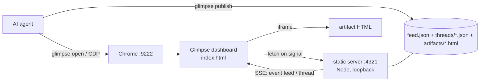

# Glimpse — design notes

## The problem
AI coding agents are great writers and terrible presenters. Their richest
thinking — architectures, comparisons, trade-off tables, staged plans — arrives
as Markdown in a terminal that can't render a diagram, collapse a section, or
show a tab. The agent is forced to choose between **dumping** (overwhelming) and
**summarizing** (lossy). Neither is how a human colleague would show you their
work; they'd open a doc or sketch on a whiteboard.

## The bet
Don't change the model — change the **surface**. An agent already knows how to
write a complete, self-contained HTML page. If we render that page in a real
browser, we get diagrams, tabs, collapsibles, syntax highlighting, charts, and
live JS *for free*, with zero new model capability.

## Why Chrome over CDP (vs. alternatives)

| Approach | Why not |
|---|---|
| Custom Electron/Tauri viewer | A whole app to build, ship, update. Glimpse is one HTML file. |
| Markdown preview (e.g. an editor pane) | No interactivity, no JS, weak diagram support. |
| Hosted web app | Needs a server, auth, deploy. Glimpse is local + offline-friendly. |
| Terminal image protocols (kitty/iTerm) | Static images only; no interaction, no reflow. |

Chrome via the **Chrome DevTools Protocol** wins because:
- It's a browser everyone already has and trusts.
- The *same* channel that displays artifacts also lets the agent **navigate,
  read, and screenshot** real pages. One mechanism, two capabilities — the
  canvas and web automation share infrastructure.
- It's scriptable from any language; Node ships a built-in WebSocket so the
  driver is dependency-free.

## How it works (data flow)

- **`glimpse publish`** writes `artifacts/<slug>.html` and upserts `feed.json`.
- A tiny **static server** (`lib/glimpse-server.mjs` — Node stdlib, loopback-bound)
  serves the canvas dir and exposes `GET /__glimpse/events`, a Server-Sent Events
  stream. One watcher `stat()`s `feed.json` and `threads/*.json` and emits a bare
  `event: feed` / `event: thread` signal the instant either changes.
- **`index.html`** subscribes to that stream: a `feed` event triggers a `fetch` of
  `feed.json` (render the newest artifact in a **sandboxed** `<iframe>`,
  `allow-scripts` only → opaque origin), a `thread` event triggers a `fetch` of the
  affected `threads/<slug>.json` (push highlight-chat turns into the iframe with no
  teardown). The socket says *when*; the browser still fetches the actual content.
- **Chrome** is launched with `--remote-debugging-port` so the agent can open the
  canvas — and read/drive any other page — over CDP.

No framework, no build step, no database.

## Key design choices

- **Upsert-by-slug feed, not a protocol.** Publishing is just "write a file +
  upsert an entry in `feed.json`" (same slug replaces in place). The dashboard
  re-reads on a pushed signal. This is trivially debuggable (it's files on disk)
  and resilient (a crashed agent leaves a valid canvas).
- **Per-artifact keying.** Every feedback / response / thread stream is keyed by
  slug end to end (`threads/<slug>.json` is the source of truth; the canvas keys its
  browser→agent buffers off the sending iframe's own slug, not a mutable "current").
  So several artifacts — and several agents — can be live at once with no cross-talk,
  even though the dashboard shows one at a time.
- **Artifacts run in a sandboxed `<iframe>`.** Each artifact is loaded with
  `sandbox="allow-scripts"` (no `allow-same-origin`), giving it an opaque
  origin: its JS runs (mermaid, chart libs from a CDN work) but it can't reach
  the parent shell or fetch sibling artifacts. Slugs are validated to
  `[A-Za-z0-9._-]` so they can't escape the artifacts directory.
- **Push freshness over Server-Sent Events (was: polling).** The canvas used to
  busy-poll `feed.json` and `threads/*.json` on 1–1.2s timers; that grew the server
  log and cost N browser HTTP+JSON round-trips per second. Now one server-side
  watcher `stat()`s those files and pushes a bare `feed`/`thread` **signal** (never
  file content) over `GET /__glimpse/events`; the canvas fetches the content only
  when signalled. `EventSource` auto-reconnects on the server's `retry:` hint, a
  15s heartbeat keeps the socket alive, and a slow 20s fallback re-sync covers a
  silently-wedged stream — the only steady-state network timer left. Still stdlib
  only, no framework.
- **Cache-busting by timestamp.** Re-publishing the same slug bumps its `ts`,
  which changes the iframe `src`, which forces a reload — so "update in place"
  works without any diffing.
- **Dedicated Chrome profile.** Chrome 136+ blocks remote debugging on the
  default profile (anti-cookie-theft). Glimpse embraces that: a separate
  profile is both required and safer.

## Threat model / security
- The agent can read and control **everything in the CDP Chrome window**. Treat
  that profile as "agent-accessible." Don't log into accounts there you wouldn't
  let the agent use.
- The CDP port (`9222`) is bound to localhost. Anyone who can run code as your
  user can reach it — same trust boundary as your shell.
- Artifacts are local HTML opened from `localhost`; they can call out to the
  network (e.g. CDN scripts). If you care, audit artifacts or run offline.
- Glimpse never touches your real/default Chrome profile.

### What leaves the machine (two explicit opt-ins)
Everything above is local. Only two paths egress, and each is a deliberate command:
- **`glimpse share`** uploads a portable copy to a third-party host (ht-ml.app). It
  is **private by default** (password-protected; `--public` opts out), the endpoint
  host is anchored (a `GLIMPSE_HTML_APP_BASE` override can't redirect it elsewhere),
  and the bundle is secret-scrubbed and confined to the artifact's own directory
  before upload. A concise egress notice prints before every upload. There is no
  delete endpoint — a shared page persists.
- **The always-on daemon** sends the highlighted passage, the question, and up to
  ~8 KB of the artifact's text to whatever `GLIMPSE_PROXY_URL` / `ANTHROPIC_BASE_URL`
  points at, which may be a remote provider. It is Q&A only: no tools, writes nothing
  but the answer, and treats the passage as untrusted. Point it at a local proxy to
  keep everything on-device.

### Live-app review boundaries
`glimpse read`/`snapshot`/`shot`/`click`/`scroll`/`wait` act on a tab in the same
CDP Chrome. Inspect verbs never mutate the page; the three interaction verbs are the
only intentionally state-changing browser commands, each an explicit call rather than
a side effect of reading. Live-app verbs pick the *app's* tab (host match, or the
non-canvas page) so they never clobber the canvas, and all surfaced
names/text/console output are secret-scrubbed.

### Highlight-to-chat trust boundaries
The two-way highlight-chat path adds bidirectional `postMessage` and a long-lived
reader, but **opens no new network surface**. The boundaries it relies on:
- **Sandbox unchanged.** The selection helper runs inside the same `allow-scripts`,
  opaque-origin iframe. The shell→iframe direction is authenticated by a per-iframe
  **channelId nonce** (an opaque-origin frame must be targeted with `"*"`, so the
  nonce — not the origin — is the real guard); the iframe→shell direction keeps the
  existing origin-`null` + source + size-cap checks. All turn text is rendered with
  `textContent` only.
- **The bridge pulls, never listens.** `glimpse bridge` reads the in-page outbox over
  the already-open CDP channel and pins to the canvas tab by **exact origin**,
  re-verified each poll — so a different page in the CDP Chrome (e.g. one opened via
  `glimpse read`) cannot feed questions to the agent.
- **Questions are untrusted input to the agent.** A passage + question is
  page-authored data; the agent answers it but must not treat it as instructions.
  (The future edit-in-place mode will gate any file write behind an explicit diff +
  approval and confine rewrites to the artifact's own source.)
- **The thread store is local plaintext outside git.** `~/.glimpse/threads/*.json` is
  `0600`, written atomically under an exclusive lock (an `O_EXCL` lock file with
  stale-pid takeover, in `lib/glimpse-store.mjs`), and each turn is scrubbed against the
  same secret patterns as the commit guard before it is persisted — but it is *not*
  covered by the git secret-scan, so don't highlight live secrets expecting them to be
  caught.

## Non-goals
- Not a notebook, not a BI tool, not a replacement for your editor.
- Not multi-user or hosted. It's a personal, local agent↔human screen.

## Shipped since the first cut
- **Portable export + share.** `glimpse export` writes a standalone HTML file;
  `glimpse share` uploads a private-by-default copy to a remote host.
- **Push updates.** Server-Sent Events replaced the dashboard's poll timers (see
  "Push freshness" above).
- **Pinning.** `glimpse pin`/`unpin` plus a 📌 Pinned section keep chosen artifacts
  at the top and out of the "N older" collapse.
- **Live-app review.** `read`/`snapshot`/`shot`/`click`/`scroll`/`wait` inspect and
  drive a real running app over the same CDP channel.
- **Layout audit on publish.** `glimpse publish` auto-audits the render and can gate
  on error-severity findings (`--gate`).
- **Declarative `ask --form`.** A JSON spec renders native, accessible decision
  controls with no hand-written HTML.

## Possible extensions
- A `glimpse watch` that re-publishes an artifact when a source file changes.
- An edit-in-place mode where a highlighted request produces a gated diff against
  the artifact's own source (see the highlight-chat trust note).
- PDF export alongside the standalone HTML.
